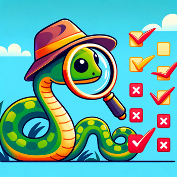

### 2. Truthy and Falsy Values

### Truthy and Falsy Values
Just as in JavaScript, Python has truthy and falsy values. However, Python considers empty lists, dictionaries, and zeros as falsy, among others. Use this knowledge to write more concise and Pythonic conditional statements.

**JavaScript:**
```javascript
let values = [0, "", [], {}, false, "0"];
values.forEach(value => {
    if (value) {
        console.log(`${value} is truthy`);
    } else {
        console.log(`${value} is falsy`);
    }
});
```



**Python**
```python
values = [0, "", [], {}, False, "0"]
for value in values:
    if value:
        print(f"{value} is truthy")
    else:
        print(f"{value} is falsy")
```
