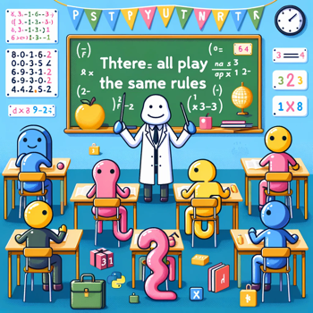

### 6. Everything Is an Object

### Everything Is an Object
Python takes "everything is an object" seriously. Functions, classes, and even basic types are objects, allowing for consistent behavior across types and facilitating concepts like first-class functions.

**JavaScript:**
```javascript
function greet() {
    console.log("Hello, world!");
}
console.log(typeof greet); // "function"
```



**Python:**
```
def greet():
    print("Hello, world!")
print(type(greet)) # <class 'function'>
```